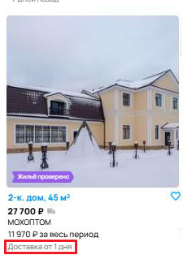

## Отчеты о дефектах для страницы Авито

### BUG-001: Опечатка в тексте кнопки "Найти" (отсутствует буква "и")
 
- **Ожидаемый результат:** 
  На кнопке отображается текст "Найти"

- **Фактический результат:** 
  На кнопке отображается текст "Найт"

- **Severity:** Low (визуальная ошибка, не влияет на функциональность)
- **Priority:** High (одна из наиболее часто используемых пользователями кнопок, опечатки в которой недопустимы, так как это вредит репутации компании)
- **Вложения:** 

---

### BUG-002: Некорректная последняя ссылка в цепочке навигации для фильтра "Посуточно"
 
- **Ожидаемый результат:** 
  Главная > Недвижимость > Дома, дачи, коттеджи > Снять > Посуточно

- **Фактический результат:** 
  Главная > Недвижимость > Дома, дачи, коттеджи > Снять > На длительный срок

- **Severity:** Medium (нарушает логику навигации)
- **Priority:** Medium (важно для UX, но не критично)
- **Вложения:**

---

### BUG-003: Неверное отображение количества объявлений в заголовке
- **Ожидаемый результат:** 
  Посуточная аренда домов, дач, коттеджей, таунхаусов в Москве и Московской области (объявлений не найдено)

- **Фактический результат:** 
  Посуточная аренда домов, дач, коттеджей, таунхаусов в Москве и Московской области 6

- **Severity:** Low (визуальная ошибка)
- **Priority:** Medium (вводит пользователя в заблуждение)
- **Вложения:**

---

### BUG-004: Карта отображает объявления не из выбранного региона (Москва → СПб)
- **Ожидаемый результат:** 
  Объявления на карте соответствуют выбранному региону (Москва и МО)

- **Фактический результат:** 
  Отображаются объявления из Санкт-Петербурга

- **Severity:** High (критичное несоответствие фильтру)
- **Priority:** High (влияет на основной функционал) 
- **Вложения:**

---

### BUG-005: Неправильное отображение объявлений при выбранном режиме "на карте"
- **Ожидаемый результат:** 
  Объявления показаны на карте в соответствии с выбранным видом отображения

- **Фактический результат:** 
  Объявления показаны "плиткой"

- **Severity:** High (нарушение функционала)
- **Priority:** High 
- **Вложения:**

---

### BUG-006: Неправильное расположение сообщения "Ничего не найдено в выбранной области поиска"
- **Ожидаемый результат:** 
  Надпись "Ничего не найдено в выбранной области поиска" находится в начала поисковой выдачи, а объявления, не удовлетворяющие всем поисковым фильтрам, должны быть в разделе "Вас может заинтересовать"

- **Фактический результат:** 
  Надпись "Ничего не найдено в выбранной области поиска" находится ниже нерелевантных объявлений

- **Severity:** Medium (нарушает логику отображения)
- **Priority:** Medium
- **Вложения:**

---

### BUG-007: Сортировка "По дате" не применяется
- **Ожидаемый результат:** 
  Объявления отсортированы по дате создания

- **Фактический результат:** 
  Сортировка отсутствует

- **Severity:** High (нарушение основного функционала)
- **Priority:** High 
- **Вложения:**

---

### BUG-008: Фильтр "Цена за сутки" работает некорректно
- **Ожидаемый результат:** 
  В выдаче находятся объявления, соответствующие фильтру

- **Фактический результат:** 
  Есть объявления вне диапазона

- **Severity:** High (критично для фильтрации)
- **Priority:** High
- **Вложения:**

---

### BUG-009: Фильтр "Посуточно" включает объявления с помесячной оплатой
- **Ожидаемый результат:** 
  В выдаче только объявления с посуточной оплатой

- **Фактический результат:** 
  Есть объявления с оплатой за месяц

- **Severity:** High (критично для фильтрации)
- **Priority:** High 
- **Вложения:**

---

### BUG-010: Некорректное указание доставки в объявлениях аренды жилья
- **Ожидаемый результат:** 
  В объявлениях нет упоминания доставки

- **Фактический результат:** 
  в объявлении указано "Доставка от 1 дня"

- **Severity:** Medium (нарушение логики)
- **Priority:** Medium (вводит в заблуждение)
- **Вложения:**

---

### BUG-011: Некорректное указание возврата в объявлениях аренды
- **Ожидаемый результат:** 
  В объявлениях нет упоминания возврата

- **Фактический результат:** 
  в объявлении указано "14 дней на возврат"

- **Severity:** Medium (нарушение логики)
- **Priority:** Medium (вводит в заблуждение)
- **Вложения:**

---

### BUG-012: Неверный расчет суммы оплаты за весь период
- **Ожидаемый результат:** 
  Сумма = цена за сутки × количество дней

- **Фактический результат:** 
  Неправильный расчет для некоторых объявлений
- **Severity:** High (неправильный расчет)
- **Priority:** High (финансовая ошибка)
- **Вложения:**

---

### BUG-013: Отсутствие суммы оплаты за весь период
- **Ожидаемый результат:** 
  Сумма указана для всех объявлений

- **Фактический результат:** 
  Нет суммы для некоторых объявлений
- **Severity:** Medium (выборочная отработка)
- **Priority:** Medium (неполная информация)
- **Вложения:**

---

### BUG-014: Опечатка в фильтре "Площадь участка" ("Да" вместо "До")
- **Ожидаемый результат:** 
  От - До

- **Фактический результат:** 
  От - Да
- **Severity:** Low (визуальная ошибка)
- **Priority:** Medium (видно только при наличии фильтра "Площадь участка")
- **Вложения:**

---

### BUG-015:  Опечатка в разделе "Путешествия" ("коко-места")
- **Ожидаемый результат:** 
  Комнаты и койко-места

- **Фактический результат:** 
  Комнаты и коко-места
- **Severity:** Low (визуальная ошибка)
- **Priority:** Low (находится внизу страницы, куда заглядывают не так часто)
- **Вложения:**

---

### BUG-016: Выдача объявлений находится сразу на 4й странице
- **Ожидаемый результат:** 
  Выдача объявлений начинается с 1й страницы

- **Фактический результат:** 
  Выдача объявлений показана на 4й странице
- **Severity:** Medium (нарушение UX)
- **Priority:** Medium 
- **Вложения:**

---

### BUG-017: Неактивная кнопка "Показать объявления" для поиска по фильтрам
- **Ожидаемый результат:** 
  Активная кнопка "Показать объявления"

- **Фактический результат:** 
  Неактивная кнопка "Ничего не найдено"
- **Severity:** High (блокирует функционал)
- **Priority:** High 
- **Вложения:**

---

### BUG-018: Ненужный фильтр "Неважно" для парковки
- **Ожидаемый результат:** 
  Для парковки не выбран какой-либо фильтр

- **Фактический результат:** 
  Выбран фильтр "Неважно"
- **Severity:** Low (работа сайта не нарушена)
- **Priority:** Medium (может существенно уменьшить количество релевантных объявлений в выдаче)
- **Вложения:**

---

### BUG-019: Отсутствие бонусов в некоторых объявлениях
- **Ожидаемый результат:** 
  Бонусы указаны для всех объявлений

- **Фактический результат:** 
  Бонусы не указаны для некоторых объявлений
- **Severity:** Low (не влияет на функционал) 
- **Priority:** Low 
- **Вложения:**

---

### BUG-020: Нерелевантные объявления в выдаче (окна, кукольный дом)
- **Ожидаемый результат:** 
  Только аренда жилья

- **Фактический результат:** 
  Посторонние объявления
- **Severity:** High (нарушение фильтрации/модерации)
- **Priority:** High 
- **Вложения:**

---

### BUG-021: Дублирование дерева навигации
- **Ожидаемый результат:** 
  Выпадающий список с видами жилья

- **Фактический результат:** 
  Дублирующее цепочку навигации и фильтры дерево
- **Severity:** Low (визуальный дефект)
- **Priority:** Low
- **Вложения:**

---

### BUG-022: Объявления не соответствуют региону поиска (Москва → СПб)
- **Ожидаемый результат:** 
  Объявления из Москвы и МО

- **Фактический результат:** 
  Объявления из СПб и ЛО
- **Severity:** High (критично для поиска)
- **Priority:** High 
- **Вложения:**

---

### BUG-023: Не у всех объявлений есть дата создания
- **Ожидаемый результат:** 
  Дата создания указана/не указана для всех объявлений

- **Фактический результат:** 
  В некоторых объявлениях дата создания указана, а в некоторых нет
- **Severity:** Medium (неполнота данных)
- **Priority:** Medium 
- **Вложения:**

---

### BUG-024: Не у всех объявлений указан адрес
- **Ожидаемый результат:** 
  Адрес указан/не указан для всех объявлений

- **Фактический результат:** 
  В некоторых объявлениях адрес указан, а в некоторых нет
- **Severity:** Medium (неполнота данных)
- **Priority:** Medium 
- **Вложения:**

---

### BUG-025: Отсутствие плашки "Новое объявление" для свежих объявлений
- **Ожидаемый результат:** 
  Плашка есть у всех новых объявлений

- **Фактический результат:** 
  Нет плашки для объявления 4-часовой давности
- **Severity:** Low (визуальный дефект)
- **Priority:** Low 
- **Вложения:**

---

### BUG-026: Несоответствие количества объявлений на карте и в выдаче
- **Ожидаемый результат:** 
  Объявления на мини-карте соответствуют объявлениям в выдаче
- **Фактический результат:** 
  На мини-карте отображено большее количество объявлений, чем в выдаче
- **Severity:** Medium (нарушение логики)
- **Priority:** Medium 
- **Вложения:**

- **Комментарий:** Такая же ситуация на самом сайте Авито

---

### BUG-027: Появление пустой страницы при переключении на "плитку"
- **Ожидаемый результат:** 
  Новая страница не появляется
- **Фактический результат:** 
  Появляется новая страница, на которой нет ничего, кроме надписи "Ничего не найдено в выбранной области поиска" и раздела "Популярное". Также кнопка "Показать объявления" становится неактивной и меняется на "Ничего не найдено"
- **Severity:** High (блокирует функционал)
- **Priority:** High 
- **Вложения:**

- **Комментарий:** Данный баг относится к сайту Авито при тех же фильтрах, что и на скриншоте к заданию

